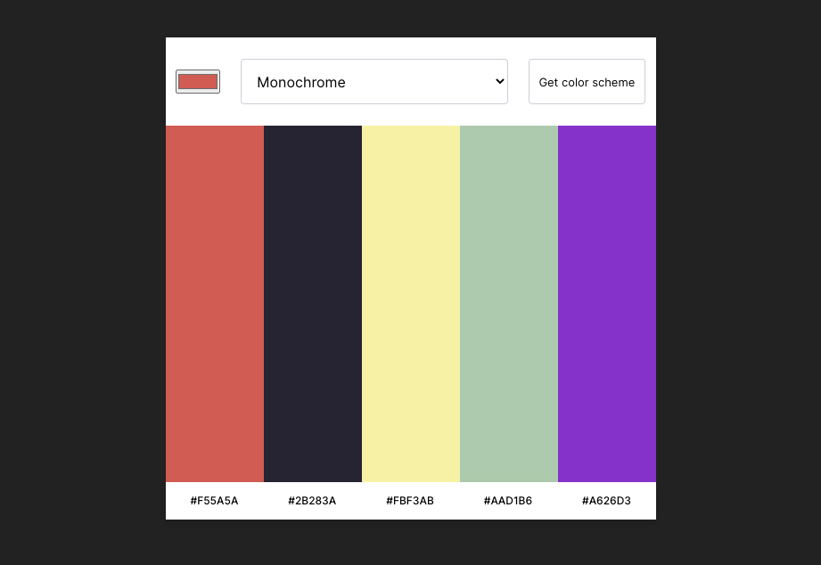

# Scrimba - Solo Project - Color Scheme Generator

This is a solution to the [Scrimba's 'The Frontend Developer Career Path', Module &: Working with API's.](https://scrimba.com/).

## Table of contents

- [Overview](#overview)
  - [The challenge](#the-challenge)
  - [Screenshot](#screenshot)
  - [Links](#links)
- [My process](#my-process)
  - [Built with](#built-with)

## Overview

### The challenge

Based on a given Figma-design, recreate the design and implement the Color Api. Without any guidance.

### Screenshot

### Links

- Solution URL: [Color Picker on Github](https://github.com/graficdoctor/color-picker)
- Live Site URL: [Color Picker Vercel](https://color-picker-ivory.vercel.app/)

## My process

### Built with

- Semantic HTML5 markup
- CSS custom properties
- Flexbox
- CSS Grid
- Mobile-first workflow
